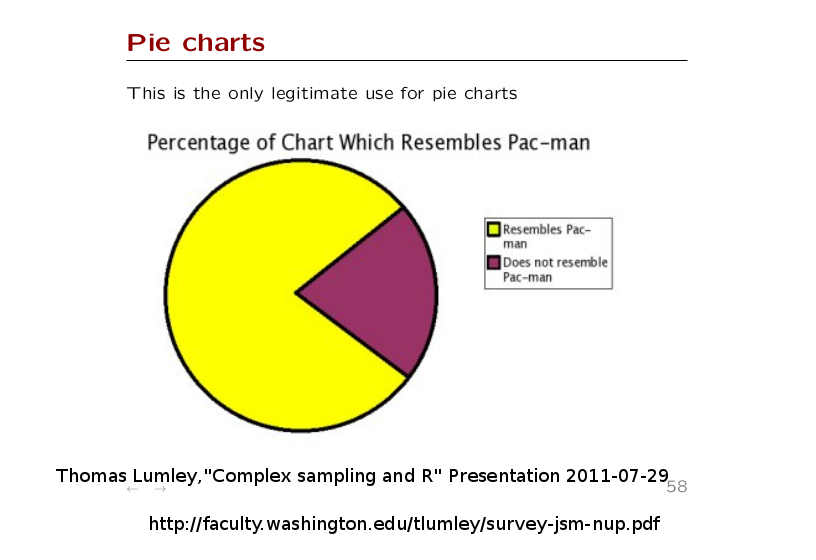
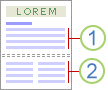

## Elementary (simple) regression part 2
- Pulling data from the internet
- Example
- Interpretation
- Mean centering
- Pleasing plots

## Let's take a look at the publicspending.txt data.
- EX: Per capita state and local public expenditures ($)	
- ECAB: Economic ability index, in which income, retail sales,  and the value of output (manufactures, mineral, and agricultural) per capita are equally weighted.	
- MET: Percentage of population living in standard metropolitan areas	
- GROW: Percent change in population, 1950-1960
- YOUNG: Percent of population aged 5-19 years	
- OLD: Percent of population over 65 years of age	
- WEST: Western state (1) or not (0) 
- STATE: Abbreviation of state

## Get Data, put in same directory as this file
```{r}
getwd()
if (!file.exists("publicspending.txt")){
    lab5.url <- "http://pj.freefaculty.org/guides/stat/DataSets/PublicSpending/publicspending.txt"
    download.file(lab5.url, destfile = "publicspending.txt")
}
lab5 <- read.table("publicspending.txt", header = TRUE)
```

- We first check to see if 'publicspending.txt' is in our working directory
- If publicspending is not found (!fileexists), run the two line between { and }
    + assign internet url to a variable
    + download the file to working directory and call it publicspending.txt
- Read data file from working directory
```{r echo = FALSE}
options(width = 75)
library(rockchalk)
```

## Look at our data
- First, we want to check the names of all of our variables
```{r}
head(lab5)
```

## Oops, that capitalization problem
- Last week, the data set on Blackboard had variables in UPPER CASE.
- You can convert them all to lower case with a single command for simpler typing.
```{r}
colnames(lab5) <- tolower(colnames(lab5))
names(lab5)
```

## Look over the data
```{r}
summarize(lab5)
````

## Request covariance matrix of whole data set
- We can also get a covariance matrix and correlation matrix of all of the variables in our dataset.
```{r eval = FALSE}
cov(lab5)

> cov(lab5)
Error: is.numeric(x) || is.logical(x) is not TRUE
```

```{r cov}
cov(lab5[ , 1:6])
```

## And the correlation matrix
- We are not including our dichotomous variable, west
```{r cor2}
cor(lab5[ , 1:6])
```

## Plot matrix of bivariate relationships
- We are not plotting our dichotomous variable, west
```{r fig.align="center"}
plot(lab5[ , 1:6])
```

## Elementary regression example
- public expenditures regressed on economic capabilities
 - Step 1. Run the regression.
```{r}
mod1 <-lm(ex ~ ecab, data = lab5)
```
- Step 2. Look at model summary.
```{r}
summary(mod1)
```

## Look at vcov
```{r}
vcov(mod1)
```

- You can use vcov info to compute model standard errors.
```{r}
sqrt(diag(vcov(mod1)))
```

## Model interpretation
- The average public expenditure (ex) is 118.98 when there is 0 economic capabilities (ecab).
- Does this interpretation make sense?
- What is public expenditure for average economic capabilities?
```{r}
mean(lab5$ecab)
# b0 + b1ecab_at_mean
118.9832 + 1.7329*96.75417
```

## Get predicted values for various values of ecab {.allowframebreaks}
```{r pom1}
predictOMatic(mod1, predVals = c(ecab = "quantile"), n = 10, interval = "confidence")
```

- ecab ranges from minimum to maximum, with 10 deciles between
- confidence intervals included at no extra charge

## That was quantiles, if you like the m+sd approach
```{r pom2}
predictOMatic(mod1, predVals = c(ecab = "std.dev."), n = 5, interval = "confidence")
```

The 5 values of ecab chosen are m-2sd, m-1sd, m, m+1sd, m+2sd.

##  If you demand 99% confidence
Notice how the Confidence Interval on predictions gets wider
```{r pom3}
predictOMatic(mod1, predVals = c(ecab = "std.dev."), n = 5, interval = "confidence", level = 0.99)
```


## Put centered predictor into regression
- We are centering at the mean, but we can choose any other value that would aid interpretation.
    + If we were studying students in grades 1-5, an intercept when grade is 0 makes little sense.
    + We could recenter on the average grade, 3, so the intercept would be the average for 3rd graders (grade - mean(grade)).
    + We could 'recenter' grade so that intercept would be the average in grade 1 (grade - 1).
- We could also put the variable on standard, normal scale with mean = 0 and variance = 1.
    + This is based on the z-scale.
    + The regression coefficient is a standardized coefficient.
    
## Use scale to 'recenter'
- First list the variable you want to change.
- If you enter nothing else in the function, the variable will be standardized with mean = 0, variance = 1.
- Setting 'scale = FALSE' will not divide the term by its variance.
- If you want to center by something other than the mean, change 'center = ' to your number.
```{r}
lab5$ecabmc <- scale(lab5$ecab,  center = TRUE, scale = FALSE)
```

## Check your work
- If rescaling worked, the original and rescaled variable will be perfectly correlated.
```{r fig.align="center"}
cor(lab5$ecab, lab5$ecabmc)
plot(ecabmc ~ ecab, lab5) # check your work
```

## Re-run the model with ecabmc
```{r}
mod2 <-lm(ex ~ ecabmc, data = lab5)
anova(mod2)
anova(mod2, mod1) # compare new with original
```

## Look at the mean centered model summary
- Recall from our manual calculation of our intercept at the mean of economic capability was 286.6485.
```{r}
summary(mod2)
```

## Fast mean centering - rockchalk
```{r echo = FALSE}
options(width = 70)
```
```{r}
mod2mc <- meanCenter(mod1, centerOnlyInteractors = FALSE)
summary(mod2mc)
```


## Lets see if the predicted values change!
```{r pom4}
predictOMatic(mod2mc, predVals = c(ecabc = "std.dev."), n = 5, interval = "confidence")
```

## Side by side:
```{r, include=F}
mod2out <- outreg(list("Uncentered" = mod1, "Centered 1" = mod2mc), tight = FALSE, type = "html",
                  browser = FALSE)
##cat(mod2out, file = "mod2out.html")
```
```{r, results = "asis"}
cat(mod2out)
```


## Pretty plots
- Use plots to explore and visualize for yourself
- Make <b>pretty plots</b> to show other people!
- Follow professional standards when creating for a publication or
  professional presentation?
- What type of plot should you use?
- What labels should you choose?
- How should you size the figure?
- Fonts and colors
- Output format, scalable vector graphics (PDF, svg) or bitmap picture
  formats (jpg, png)?

## What type of plot should you use?

- Pie charts are never a good choice.

## What type of plot should you use?
- Bar plots for categorical data.
- Histograms will seldom be demonstrated in on-paper publications because they
"waste space", may be OK in electronic media.
- Scatterplots are useful to illustrate how two variables are changing
(or not changing) together (maybe nonlinear).

## Presentation medium
- On-paper publications will restrict use of graphics
- Slide shows & posters welcome graphics
- Online journals may emphasize plots
- Check your competitors: What type of figures do publications use?
- How is the picture going to help the reader understand the story you are telling?

## What labels should you choose?
- By default, R may provide bland or no title.
- axis labels are literal
```{r fig.align="center"}
plot(ex ~ ecab, data = lab5)
```

## Labels
- Take care to make axis labels succinct, but informative
- R: most plots accept xlab and ylab character string arguments.
- If possible, squeeze some measurement info into the axes.

## Plot Titles may be Optional for some purposes.
- All plots need titles, of course. But some people don't generate
  titles from the plotting software, but rather in the document
  preparation process
- Publishers would rather typeset titles to match document style!
    - APA guidelines instructs you to exclude titles for figures.
- You can add titles to posters and papers however you like, either in
  the plotting software or in the document preparation process

## And a legend
- Legends can be placed inside a plot or in the margins with inset
```{r fig.align="center"}
plot(ex ~ ecab, xlab = "Economic capability", ylab = "Per capita public expenditure", 
     main = "Expenditure Predicted by Economic Capability", type = "n", data = lab5)
points(lab5[lab5$west == 0, "ecab"], lab5[lab5$west == 0, "ex"], pch = 0)
points(lab5[lab5$west != 0, "ecab"], lab5[lab5$west != 0, "ex"], pch = 4)
abline(mod1)
legend("bottomright",legend = c("Eastern", "Western"), pch = c(0,4), title = "States")
```

## How should you shape the figure?{.allowframebreaks}
- Publishers will provide guidelines on minimum size fonts in figures
- But often allow you some freedom to select the <b>aspect ratio</b>
- The "golden rectangle" or the  "golden ratio" suggested by Edward Tufte.
    + Suggests wider, shorter plots: "[g]raphics should tend toward
      the horizontal" (<i>The Visual Display of Quantitative
      Information</i> (2001), p. 186). 
    + The "golden rectangle" suggests height/width ratio 1/1.618 (the
	same used in Grecian temples)
	+ We approximate by height/width =  1/1.5.
    + Some flexibility allowed to avoid "crowded" graphs.
    + All plots in this presentation are 4 inches tall and 6 inches wide.
- APA guidelines:
	+ two column document: width maximum 3.25"
	+ one column document: width maximum 6.875.
	+ Caution, the 1 inch margin rule sets maximum at 6.5"
- Key element is that after resizing, text must still be legible. 
- Here is an example or one and two columns: 

## Fonts and colors
- Black and gray-scale plots travel better than color when paper
  output is needed
- Conventions and journals may have guidelines on figures.
    + Some journals will not accept figures with colors (or will send the bill to you for printing).

## Fonts need to be picked carefully as well.
- Some people (Prof Johnson) prefer to have fonts in figures match text
- APA guidelines call for sans serif fonts (e.g., Helvetica or Arial is sans serif).
- The font can range from 8-12 points, but must withstand "re-scaling"
effects.
- Run your code to manufacture plots with the pointsize argument at 8
  or 10, but be careful to specify height and widht correctly at same time.
- To see what you are going to end up with, important to have a
  graphic display that is sized accurately to match the desired
  dimensions.

## In any environment except RStudio...

- Run this to open a separate graphing window with the default type
for your computer
```
dev.new(width = 6, height = 4)
```

- Run the plot, you'll see what fits
- Many options to control how large fonts will turn out.
- This is for experimenting, not necessarily for saving.

## Because RStudio does not allow dev.new()
- RStudio fails with "dev.new()"
- RStudio insists you use a platform specific graphic device
	+ linux: X11(width = 6, height = 4)
	+ Macintosh: quartz(width = 6, height = 4)
	+ Windows: windows(width = 6, height = 4)(
- That <i>should</i> pop up a screen device on which the next plot
  will be shown.

## Save to an external file
- Mac and Windows graphics devices have a "Save As" feature.
- That's not entirely reliable because the graph may not resize
perfectly into some saved format.
- Best approach: create a device in a file, write the graph in
directly.
- described in Professor Johnsons FirstR-01 slides as well as several
of his plots lectures from the R course
- Remember to finish off the file by running dev.off() at the end.

## Example: Saving to PDF
- To save a plot to an external file in PDF format:
```{r}
pdf("SampleGraph.pdf", width = 7.5, height = 5, onefile = FALSE, paper = "special")
## Re-run all the plotting commands
plot(ex ~ ecab, xlab = "Economic capability", ylab = "Per capita public expenditure", 
     main = "Expenditure Predicted by Economic Capability", type = "n", data = lab5)
##points(lab5[lab5$west == 0, "ecab"], lab5[lab5$west == 0, "ex"], pch = 0)
##points(lab5[lab5$west != 0, "ecab"], lab5[lab5$west != 0, "ex"], pch = 4)
## Why previous?
## Try this for more direct fix for same
## points(ex ~ ecab, data = lab5[lab5$west == 0, ], pch = 0)
## points(ex ~ ecab, data = lab5[lab5$west != 0, ], pch = 4)
## Or this, which is what I'd actually use
points(ex ~ ecab, data = lab5, pch = ifelse(lab5$west == 0, 0, 4))
abline(mod1)
legend("bottomright", legend = c("Eastern", "Western"), pch = c(0,4), title = "States")
dev.off()
```

## To save to other formats
- Replace the first line that specifies the format of the output
device.
- PNG requires width and height in pixels
```
png("SampleGraph.png", width = 800, height = 600)
```
- Windows metafile:
```
win.metafile("SampleGraph.wmf", height = 4, width = 6)
```

- Run one of these that works for you needs, then run the plot
  commands, then dev.off()
    
    
